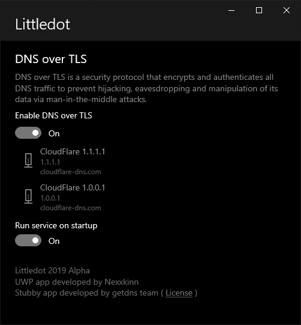

# Littledot

A simplified DNS over TLS ( DoT ) tool for Windows 10.

### DNS over TLS

DNS over TLS ( DoT ) is a security protocol that encrypts and authenticates all DNS traffic 
to prevent hijacking, eavesdropping and manipulation of its data via man-in-the-middle attacks.
It also offers as an alternative solution to other available protocol such as DNS over HTTP (DoH), DNSSEC, DNSCurve, DNSCrypt, and IPSEC 

### Resources
- [**Specification for DNS over Transport Layer Security**](https://tools.ietf.org/html/rfc7858]) from IETF
- [**Stubby**](https://github.com/getdnsapi/stubby/) - A local DNS Privacy stub resolver (using DNS-over-TLS)

### Donation
If you find this project to be useful, you can help me by either share this app to others who need it, buy the paid version in the store, or give me a cup of tea ;)

 
